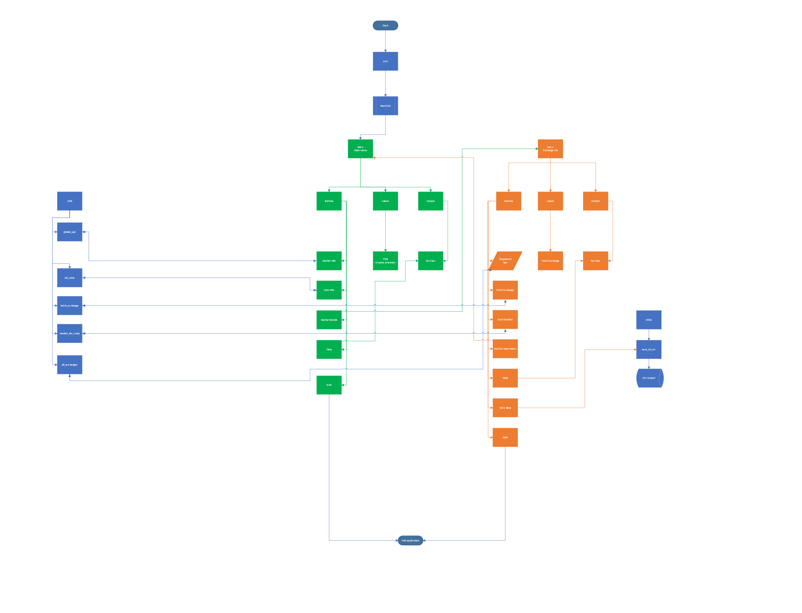

# Crypto viewer

## _Cryptocurrency API_

This application will fetch cryptocurrency data from the Coin API webpage.  
The following solutions/packages were used: 
- Poetry venv
- requests
- Tkinter
- plotly

Overview:

- [Coin Api main webpage]([https://www.coinlore.com/cryptocurrency-data-api](https://www.coinlore.com/cryptocurrency-data-api))

## Owner

- Adelina Lazar - [adelinaglazar@gmail.com](https://gmail.com/)

## Release Date

- 14.04.2022

## Access

- All Users

# Technical Details

## Description

- Available directly on the [CoinLore website]([https://www.coinlore.com/cryptocurrency-data-api](https://www.coinlore.com/cryptocurrency-data-api))

## Current Version

- 1.0.0

## Architecture

##Process Flow

## Support Contact

- Adelina Lazar - adelinaglazar@gmail.com

## Endpoints

- [[Global API](https://api.coinlore.net/api/global/)](https://api.coinlore.net/api/global/))  
- [[All Coins](https://api.coinlore.net/api/tickers/)](https://api.coinlore.net/api/tickers/](https://api.coinlore.net/api/tickers/))  
- [[Market for coins](https://api.coinlore.net/api/coin/markets/?id=90)](https://api.coinlore.net/api/coin/markets/?id=90](https://api.coinlore.net/api/coin/markets/?id=90))  
- [[All Exchanges](https://api.coinlore.net/api/exchanges/)](https://api.coinlore.net/api/exchanges/](https://api.coinlore.net/api/exchanges/))  
- [[Fetch Exchange]([https://api.coinlore.net/api/exchange/?id=5](https://api.coinlore.net/api/exchange/?id=5))]([https://api.coinlore.net/api/exchange/?id=5](https://api.coinlore.net/api/exchange/?id=5))  

  

<table>  
<tr>  
<td> 1 </td>  
<td> /global/ </td>  
<td>  GET  </td>  
<td>  Get the information about crypto market  </td>  
</tr>  
<tr>  
<td> 2 </td>  
<td>  /tickers/{start},{limit}  </td>  
<td>  GET  </td>  
<td>  Get the information about all coins, maximum result 100 coins per request/page  </td>  
</tr>  
<tr>  
<td> 3 </td>  
<td>  /coin/markets/  </td>  
<td>  GET  </td>  
<td>  Get the first 50 markets for specific coin  </td>  
</tr>  
<tr>  
<td> 4 </td>  
<td>  /exchange/{id}  </td>  
<td>  GET  </td>  
<td>  Get specific exchange by ID  </td>  
</tr>  

# Release Notes

<table>  
<tr>  
<th> Version </th>  
<th> Status </th>  
<th> Release Date </th>  
<th> End of Life Date </th>  
</tr>  
<tr>  
<td>  1.  </th>  
<td> Latest Version  </th>  
<td>  14th April 2022  </th>  
<td>  TBD </th>  
</tr>  
</table>